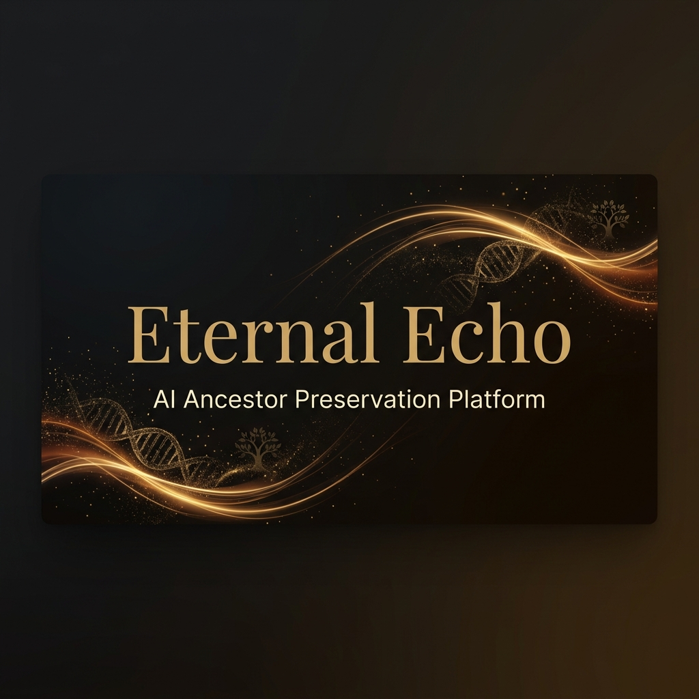

<p align="center">
  
</p>

<h1 align="center">🕊️ Eternal Echo</h1>

<p align="center">
  <strong>AI-Powered Ancestor Preservation Platform</strong><br/>
  <em>Preserve their voice. Keep their wisdom alive. Talk to them forever.</em>
</p>

<p align="center">
  <a href="#features"></a>
  <a href="#tech-stack"></a>
  <a href="#quick-start"></a>
  <a href="#architecture"></a>
</p>

<p align="center">
  
  
  
  
  
  
  
</p>

---

## 💡 The Problem

> _"What would you give to hear their voice one more time?"_

When a family elder passes away, their stories, values, life lessons, and the unique way they expressed love are gone forever. Photos and videos capture moments — but not the ability to **have a conversation** with the person who shaped you.

**Eternal Echo** changes that.

---

## ✨ Features <a name="features"></a>

<table>
<tr>
<td width="50%">

### 🎙️ Multi-Source Memory Ingestion
Upload voice recordings, handwritten letters, journals, WhatsApp chat exports, and interview answers. Every source becomes part of the ancestor's living memory.

</td>
<td width="50%">

### 🧠 AI Persona Distillation
Claude builds a nuanced personality profile — speech patterns, cultural values, humor, and wisdom — from all uploaded sources. Not a chatbot. A *presence*.

</td>
</tr>
<tr>
<td width="50%">

### 🗣️ Voice Cloning & Synthesis
ElevenLabs clones their actual voice from recordings. When audio is unclear, a warm fallback voice preserves the spirit of conversation.

</td>
<td width="50%">

### 🔍 RAG-Powered Memory Recall
Every conversation is grounded in real memories. pgvector semantic search retrieves the most relevant stories and values for each question.

</td>
</tr>
<tr>
<td width="50%">

### 🌍 Multilingual First-Class Support
Built for South Asian and Arab families — **Urdu**, **Arabic**, and **English** are first-class citizens. Auto-detects language and responds naturally.

</td>
<td width="50%">

### 👨‍👩‍👧‍👦 Family Sharing & Invites
Email magic links let family members start conversations with preserved ancestors. No account needed — just a link and a moment of connection.

</td>
</tr>
<tr>
<td width="50%">

### 🎤 Recording Studio
Browser-based audio recorder for proactive interviews. Ask your elder the questions that matter while you still can.

</td>
<td width="50%">

### 💳 Stripe-Powered Pricing
Free, Family ($9/mo), and Legacy ($25/mo) tiers. Simple checkout. No payment details stored in the app.

</td>
</tr>
</table>

---

## 🏗️ Architecture <a name="architecture"></a>

```
┌──────────────────────────────────────────────────────────────────┐
│                        ETERNAL ECHO                              │
├──────────────────────────────────────────────────────────────────┤
│                                                                  │
│   ┌─────────────┐    ┌──────────────┐    ┌─────────────────┐    │
│   │  Next.js 14  │───▶│  Supabase    │───▶│  pgvector       │    │
│   │  App Router  │    │  Auth + DB   │    │  Embeddings     │    │
│   └──────┬───────┘    └──────────────┘    └─────────────────┘    │
│          │                                                       │
│          ├───────────────────┬──────────────────┐                │
│          ▼                   ▼                  ▼                │
│   ┌─────────────┐    ┌──────────────┐    ┌─────────────────┐    │
│   │   Claude     │    │  OpenAI      │    │  ElevenLabs     │    │
│   │  Sonnet 4    │    │  Whisper +   │    │  Voice Clone    │    │
│   │  Persona &   │    │  Embeddings  │    │  + Synthesis    │    │
│   │  Chat Engine │    │  (1536-dim)  │    │  (Multilingual) │    │
│   └─────────────┘    └──────────────┘    └─────────────────┘    │
│                                                                  │
│   ┌─────────────┐    ┌──────────────┐    ┌─────────────────┐    │
│   │  LangChain   │    │  Supabase    │    │  Stripe         │    │
│   │  Chunking +  │    │  Storage +   │    │  Checkout       │    │
│   │  Splitting   │    │  Realtime    │    │  Subscriptions  │    │
│   └─────────────┘    └──────────────┘    └─────────────────┘    │
│                                                                  │
└──────────────────────────────────────────────────────────────────┘
```

---

## 🛠️ Tech Stack <a name="tech-stack"></a>

| Layer | Technology | Purpose |
|-------|-----------|---------|
| **Frontend** | Next.js 14 (App Router), React 18, Framer Motion | SSR pages, protected routes, streaming APIs, animations |
| **Styling** | Tailwind CSS 4, Custom design tokens | Gold/cream/ink color system, glassmorphism, particle effects |
| **Auth** | Supabase Auth | Email/password + Google OAuth |
| **Database** | Supabase Postgres + pgvector | Memory storage, vector embeddings, RLS policies |
| **Storage** | Supabase Storage | Voice recordings, memory files, conversation audio |
| **AI — Persona** | Anthropic Claude (claude-sonnet-4-20250514) | Persona distillation + conversational responses |
| **AI — Transcription** | OpenAI Whisper | Audio → text transcription |
| **AI — Embeddings** | OpenAI text-embedding-3-small | 1536-dim vectors for semantic memory search |
| **AI — Voice** | ElevenLabs (multilingual) | Voice cloning + speech synthesis |
| **Text Processing** | LangChain + Text Splitters | Document chunking, WhatsApp parsing |
| **Payments** | Stripe Checkout | Subscription management |
| **Deployment** | Vercel | Edge-optimized hosting |

---

## 🚀 Quick Start <a name="quick-start"></a>

### Prerequisites

- Node.js 18+
- A [Supabase](https://supabase.com) project
- API keys for [Anthropic](https://console.anthropic.com), [OpenAI](https://platform.openai.com), and [ElevenLabs](https://elevenlabs.io)

### 1. Clone & Install

```bash
git clone https://github.com/DevWasim/eternal-echo.git
cd eternal-echo
npm install
```

### 2. Configure Environment

Create `.env.local` in the project root:

```env
# ── Supabase ──
NEXT_PUBLIC_SUPABASE_URL=https://your-project.supabase.co
NEXT_PUBLIC_SUPABASE_ANON_KEY=your-anon-key
SUPABASE_SERVICE_ROLE_KEY=your-service-role-key

# ── AI Services ──
ANTHROPIC_API_KEY=sk-ant-...
OPENAI_API_KEY=sk-...
ELEVENLABS_API_KEY=xi-...

# ── App ──
NEXT_PUBLIC_APP_URL=http://localhost:3000

# ── Stripe ──
STRIPE_SECRET_KEY=sk_test_...
STRIPE_PRICE_FAMILY=price_...
STRIPE_PRICE_LEGACY=price_...
```

### 3. Set Up Database

1. Open your Supabase project → **SQL Editor**
2. Run `supabase/migrations/001_initial_schema.sql`
3. Verify **Storage** buckets: `memory-files`, `conversation-audio`
4. Enable **Realtime** for `processing_events` and `ancestors`

### 4. Launch

```bash
npm run dev
```

Open **[http://localhost:3000](http://localhost:3000)** 🎉

---

## 🔄 Core Product Flows

```
┌─────────┐     ┌──────────┐     ┌───────────┐     ┌──────────┐     ┌─────────┐
│  Sign Up │────▶│  Create  │────▶│  Upload   │────▶│   AI     │────▶│  Chat   │
│  / Login │     │ Ancestor │     │ Memories  │     │ Process  │     │  Live   │
└─────────┘     └──────────┘     └───────────┘     └──────────┘     └─────────┘
                                       │                │
                                       ▼                ▼
                                 ┌───────────┐   ┌──────────────┐
                                 │ Voice Rec  │   │ Persona      │
                                 │ WhatsApp   │   │ Voice Clone  │
                                 │ Letters    │   │ Embeddings   │
                                 │ Journals   │   │ RAG Index    │
                                 └───────────┘   └──────────────┘
```

| Flow | Description |
|------|-------------|
| **🔐 Auth** | Email/password and Google OAuth via Supabase |
| **🧙 Ancestor Wizard** | Step-by-step: identity → source uploads → voice setup → processing → ready |
| **⚙️ Processing Pipeline** | Whisper transcription → WhatsApp parsing → LangChain chunking → OpenAI embeddings → Claude persona → ElevenLabs voice |
| **💬 Conversation Engine** | Vector search (top 6 memories) → Claude responds in-character → ElevenLabs speech → persisted messages |
| **📊 Dashboard** | Ancestor cards, status tracking, chat launch, memory browser |
| **🎤 Recording Studio** | Browser MediaRecorder for proactive elder interviews |
| **📨 Share & Invite** | Magic link email invites for family members |
| **💰 Pricing** | Free / Family ($9) / Legacy ($25) via Stripe Checkout |

---

## 💰 Cost Economics

| Service | Cost | At Scale |
|---------|------|----------|
| **Supabase** | Free tier | ~50K rows for early pilots |
| **OpenAI Whisper** | $0.006/min | 1 hour recording ≈ $0.36 |
| **OpenAI Embeddings** | $0.02/1M tokens | Practically free at family scale |
| **ElevenLabs** | ~$5/month (Starter) | Voice cloning included |
| **Claude Sonnet** | $3/$15 per 1M tokens (in/out) | ~$0.002 per conversation turn |

> 💡 **Unit economics are strong** for a $9/month family plan with queued processing and cached responses.

---

## 🗺️ Roadmap

- [ ] 📱 **WhatsApp Integration** — Chat with ancestors via Twilio on WhatsApp
- [ ] 📲 **React Native App** — Voice-first mobile conversations
- [ ] 📖 **Memory Book Generator** — Auto-typeset PDF memoir from conversations
- [ ] 🎥 **Video Avatar** — HeyGen-powered animated ancestor photo

---

## 🌸 Sensitive UX Philosophy

Eternal Echo handles grief, memory, and cultural identity. The UX is built around empathy:

| Scenario | Response |
|----------|----------|
| Voice cloning fails | *"The audio we have is a bit unclear, but we've created a warm alternative voice that captures their spirit."* |
| Sparse memory content | *"We've preserved what we have. Every memory you add makes the conversation richer."* |
| Ancestor lacks context | The model responds naturally: *"I don't quite remember that"* or *"That was before my time."* |
| API/system errors | Never shown to families. Graceful fallbacks only. |

---

## 📁 Project Structure

```
eternal-echo/
├── src/
│   ├── app/
│   │   ├── (auth)/           # Login, Register pages
│   │   ├── ancestor/         # Ancestor wizard
│   │   ├── api/              # API routes (chat, processing, stripe)
│   │   ├── chat/             # Conversation interface
│   │   ├── dashboard/        # Main dashboard
│   │   ├── invites/          # Family invite acceptance
│   │   ├── layout.tsx        # Root layout
│   │   └── page.tsx          # Landing page
│   ├── components/
│   │   ├── AncestorWizard.tsx
│   │   ├── AudioRecorder.tsx
│   │   ├── ChatExperience.tsx
│   │   ├── ProcessingScreen.tsx
│   │   ├── RecorderStudio.tsx
│   │   ├── WhatsAppImporter.tsx
│   │   └── ...
│   ├── lib/
│   │   ├── chat.ts           # Conversation engine
│   │   ├── embeddings.ts     # Vector embedding utils
│   │   ├── persona.ts        # AI persona builder
│   │   ├── voice.ts          # ElevenLabs integration
│   │   └── ...
│   ├── contexts/             # React context providers
│   └── types/                # TypeScript type definitions
├── supabase/
│   └── migrations/           # Database schema + RLS policies
├── public/                   # Static assets
└── middleware.ts             # Auth middleware
```

---

## 🚢 Deploy to Vercel

1. Push to GitHub
2. Import in [Vercel](https://vercel.com)
3. Add all environment variables
4. Set `NEXT_PUBLIC_APP_URL` to your production domain
5. Add `https://your-domain.com/auth/callback` to Supabase Auth redirect URLs
6. **Deploy** ✨

---

<p align="center">
  <br/>
  <strong>Built with ❤️ for families who never want to forget.</strong>
  <br/><br/>
 
  <br/><br/>
  <a href="https://github.com/DevWasim/eternal-echo/stargazers">⭐ Star this repo</a> · 
  <a href="https://github.com/DevWasim/eternal-echo/issues">🐛 Report Bug</a> · 
  <a href="https://github.com/DevWasim/eternal-echo/issues">💡 Request Feature</a>
</p>
